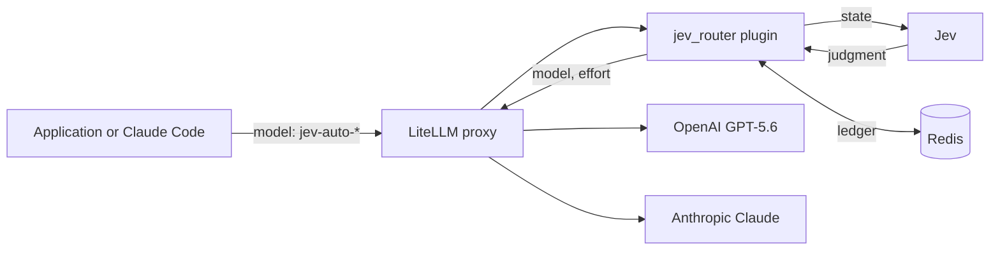
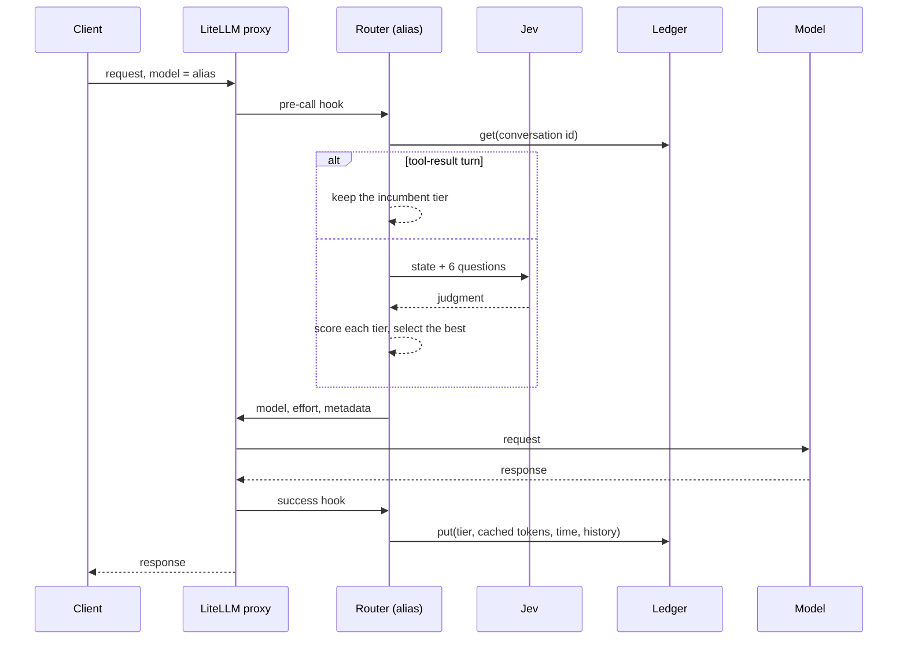
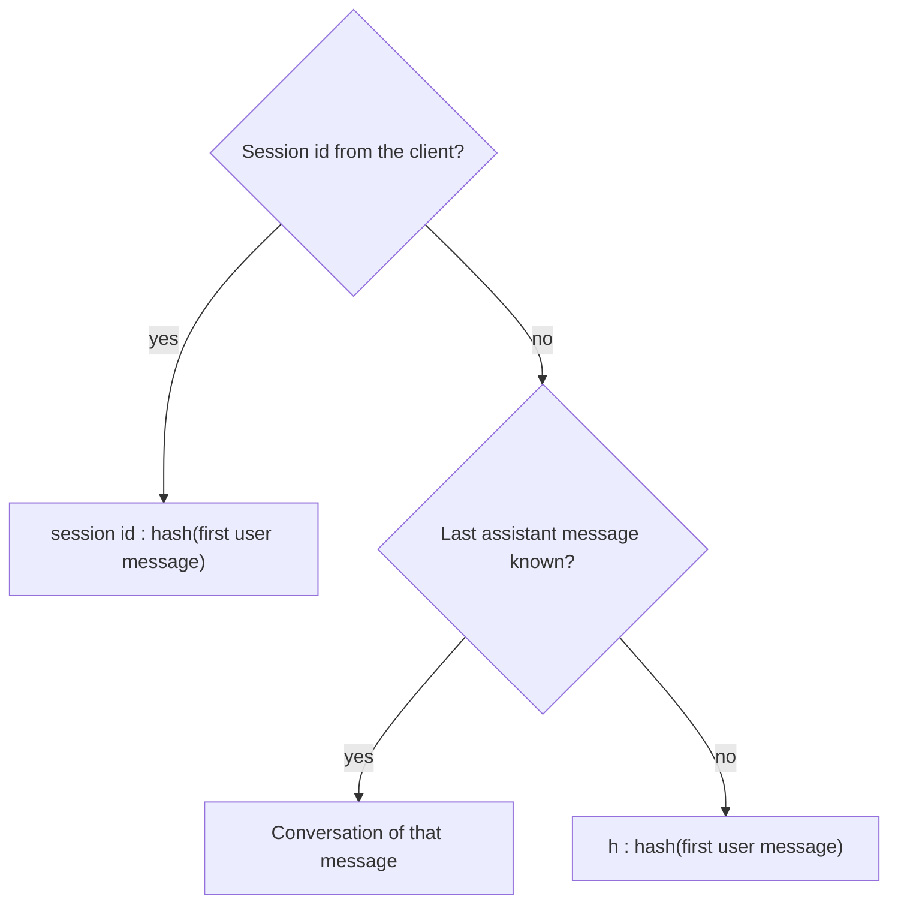
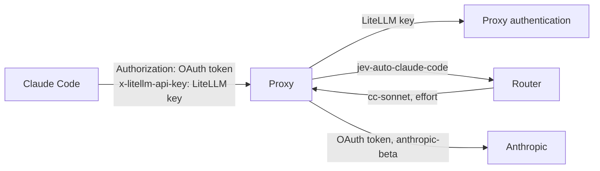

# Jev model router: design

## 1. Purpose

The router is a plugin for the LiteLLM proxy. For each conversation turn, it asks Jev what the turn needs. Then it selects the cheapest model and effort that satisfy that need. It keeps a record of each conversation, so that the prompt cache of the current model has a value in the selection.

Applications send requests to the proxy with a router alias as the model name. The proxy returns a standard response.

## 2. System overview



One proxy holds many routers. Each router is one file in `deploy/routers/`. The file gives the router its alias, its tiers, and its cost parameters. Deployments are shared and are in `deploy/config.yaml`.

| Router alias | File | Tiers | Credential |
|---|---|---|---|
| `jev-auto-gpt` | `gpt.yaml` | luna, terra, sol | `OPENAI_API_KEY` |
| `jev-auto-claude` | `claude.yaml` | haiku, sonnet, opus | `ANTHROPIC_API_KEY` |
| `jev-auto-claude-code` | `claude-code.yaml` | cc-haiku, cc-sonnet, cc-opus | The claude.ai login of the client |

## 3. Components

| Module | Function |
|---|---|
| `core/request.py` | Reads the request into a `Turn`: messages, tools, system prompt, current message, token counts |
| `core/identity.py` | Gives the conversation an identifier |
| `core/fastpath.py` | Applies the rules that do not need Jev |
| `core/state.py` | Makes the compact state that Jev receives |
| `core/judge.py` | Sends the state and 6 questions to Jev and returns a `Judgment` |
| `core/ledger.py` | Keeps the incumbent tier, cache data, and history of each conversation |
| `core/scorer.py` | Computes the utility of each tier and selects the best |
| `core/router.py` | `decide()` and `observe()` |
| `litellm_plugin.py` | Connects the proxy hooks to the routers |
| `eval/` | Evaluates a router against a labelled dataset |

## 4. Request flow



The plugin changes 3 fields of the request: the model, the effort, and the metadata. It does not change the messages or the tools.

## 5. Judgment

Jev receives a compact state, not the full transcript. The state has the current message, the last 6 messages in short form, one line for each older message, the start of the system prompt, the tool names, and the last 5 routing decisions. The state limit is 8000 tokens.

Jev answers 6 questions in one call:

| Question | Type | Use |
|---|---|---|
| `required_tier` | Level 0 to 3, with a probability for each level | Quality risk |
| `task_type` | One of 8 categories | Analysis |
| `continues_task` | Probability | Switch cost |
| `needs_history` | Probability | Switch cost |
| `quality_complaint` | Probability | Escalation |
| `expected_output` | Short, medium, or long | Output cost |

The levels are: 0 trivial, 1 routine, 2 demanding, 3 frontier. Each tier has a level in the router file.

## 6. Selection

For each tier that can serve the request, the scorer computes:

```
cost         = LiteLLM price of (prompt tokens − cached tokens) + cached tokens + expected output tokens
quality_risk = Σ P(level = t) × tier_penalty[t − tier.level]      for each t above tier.level
switch_cost  = 0 if the tier is the incumbent
             = base + continuity × P(continues_task) × P(needs_history)
               + thinking_loss if the model changes + cross_provider if the provider changes
utility      = −lambda_cost × cost − lambda_quality × quality_risk − switch_cost
```

The tier with the highest utility wins. All 3 terms are in US dollars for the current turn.

Three rules apply before the scores:

| Condition | Result |
|---|---|
| The last message is a tool result and the conversation has an incumbent | The incumbent tier. Jev is not called |
| `required_tier` confidence is below `min_confidence` | The incumbent tier, or the default tier |
| `quality_complaint` is above `complaint_threshold` | Only tiers above the incumbent in the ladder can win |

If Jev does not answer in `timeout_ms`, the router keeps the incumbent tier, or uses the default tier.

## 7. Conversation identity



LiteLLM reads the session id from `x-litellm-session-id`, `x-claude-code-session-id`, and the session headers of other clients. The hash of the first user message keeps the threads of one session apart. The router ignores `role: system` entries that a client adds after the first user message.

## 8. Ledger and cache

Each router has its own ledger in the proxy cache. The ledger entry of a conversation has: the incumbent tier, the model and effort, the time of the last request, the cached tokens of the last response, the token count of the system prompt and tools, and the last decisions.

The scorer predicts the cached tokens of each tier from the ledger:

| Candidate tier | Predicted cached tokens |
|---|---|
| Same model and effort as the incumbent, in the cache TTL | Cached tokens of the last response |
| Same model, different effort, provider Anthropic | System prompt and tools only |
| Same model, different effort, provider OpenAI | 0 |
| Different model, or after the cache TTL | 0 |

The success hook writes the real cached tokens to the ledger after each response.

## 9. Claude Code

Claude Code sends Anthropic Messages requests to the proxy. The variables in `deploy/claude-code.env` set the proxy address, the router alias, and a LiteLLM key in a custom header. The claude.ai login stays the Anthropic credential. The proxy forwards the OAuth token and the `anthropic-beta` header to Anthropic for the `cc-*` deployments only.



Background calls of Claude Code go to `cc-haiku` directly. Tool-result turns of an agent loop use the fast path.

## 10. Evaluation

A dataset is a YAML file of conversations. Each turn can have an expected level, an expected fast path, or an expected complaint. `jev-router eval run` plays the dataset through a router and writes a JSON report and a Markdown summary. Thresholds in the dataset set the exit code.

| Mode | Client | Model calls | Cache and cost |
|---|---|---|---|
| `simulate` | In-process router | None. Jev only | Simulated |
| `live` | HTTP to the proxy | Real | Observed |
| `claude-code` | `claude -p` for each turn | Real, on the claude.ai login | Observed |

`jev-router eval preflight` sends 2 identical requests to each tier of a router and confirms the effort value and a cache hit.

## 11. Records

The plugin writes 2 events for each routed request to `JEV_ROUTER_LOG_FILE`:

| Event | Content |
|---|---|
| `decision` | Alias, conversation id, tier, reason, Jev judgment, Jev latency, the score of each tier |
| `observed` | Alias, conversation id, tier, model, prompt tokens, cached tokens, cost |

The reasons are: `fresh`, `stay`, `switch`, `tool_result`, `quality_complaint`, `low_confidence`, and `jev_unavailable`.
